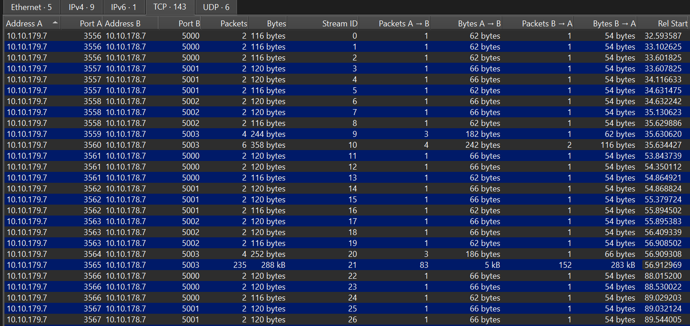
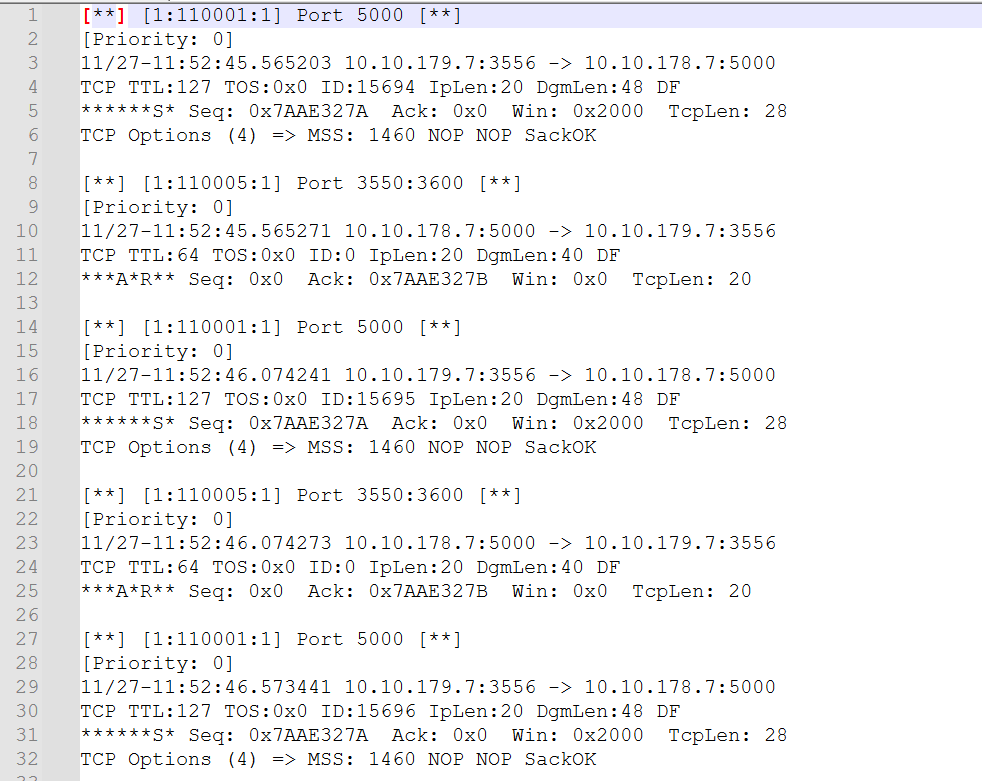
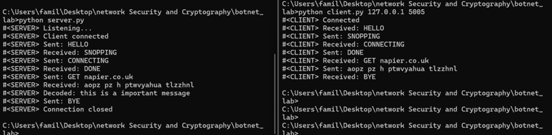

<h1>
    <a href="https://github.com/prsilvaa/botnet-analysis-and-ids-detection" target="_blank">
        Botnet Analysis and IDS Detection
    </a>
</h1>

<h2>Project Objective</h2>

The objective of this project was to design and deploy a virtualised testbed environment to analyse the behaviour of a botnet agent and its command-and-control (C2) server. The project focused on capturing and analysing botnet network traffic, understanding command and response mechanisms, and developing an intrusion detection system (IDS) to detect botnet activity.

<h2>Tools Used</h2>
<ul>
    <li>Linux (Bot and Controller virtual machines)</li>
    <li>Snort Intrusion Detection System (IDS)</li>
    <li>Wireshark</li>
    <li>Python (custom bot and command server)</li>
    <li>Virtualised lab environment (College-provided virtual machines)</li>
</ul>

<h2>Skills Gained</h2>
<ul>
    <li>Botnet architecture and behaviour analysis</li>
    <li>Command-and-control (C2) traffic identification</li>
    <li>Network traffic capture and filtering</li>
    <li>Snort IDS rule creation and tuning</li>
    <li>Python socket programming</li>
    <li>PCAP analysis and protocol inspection</li>
    <li>Incident detection and investigation</li>
</ul>

<h2>Outcome</h2>

I successfully deployed and analysed both a provided botnet sample and a custom Python-based bot in an isolated virtual environment. Network traffic was captured and analysed to identify reconnaissance activity, command-and-control communications, and response patterns. Based on this analysis, custom Snort IDS rules were developed and tested to detect botnet activity while minimising false positives. This project strengthened my understanding of real-world botnet operations and intrusion detection techniques used in enterprise security environments.

    <h3>Botnet Testbed Environment</h3>
    
    
Isolated virtual machines configured for bot and controller communication.

    <h3>Network Traffic Analysis</h3>
    
    
Captured and filtered botnet command-and-control traffic using Wireshark.

    <h3>Snort IDS Detection</h3>
    
    
Custom Snort rules detecting botnet activity and generating alerts.

    <h3>Custom Python Bot</h3>
    
    
Python-based bot and server used to simulate controlled C2 traffic for IDS testing.

